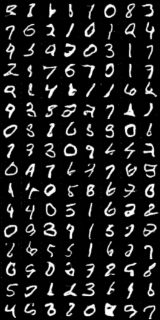
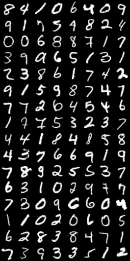
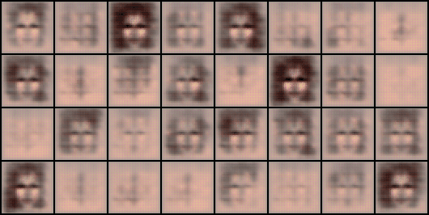

## Notes

Checkerboard artifact is visible prominently especially on rgb images such as `CelebA HQ` dataset. For `CelebA` dataset all male and images from train, validation folder was merged into a single images folder.

To train a dataset with different channel count change `self.IMG_CHANNELS` to appropriate value. Also change the dataset path accordingly,

```
#self.dataset = datasets.MNIST(root='dataset/', train=True, transform=self.transform_config, download=True)
self.dataset = datasets.ImageFolder(root='celeba_hq_dataset', transform=self.transform_config)
```

<br>

## Results

Result of the python code on MNIST (not the jupyter notebook) with, 
```
self.LEARNING_RATE = 2e-4
self.BATCH_SIZE = 128
self.IMAGE_SIZE = 64
self.IMG_CHANNELS = 1
self.Z_DIM = 100
self.G_CHANNELS = 64
self.D_CHANNELS = 64
self.NUM_EPOCHS = 3
```





Result on `CelebA HQ` dataset trained for a small time,
```
self.IMG_CHANNELS = 3
self.NUM_EPOCHS = 4
```



<br>

## TODO

- Improve code structure and comments.
- Allow easy switch between image dataset with different channel count. 
- Weight saving and loading with inference.
- Latent space control to generate random images.
- Interpolate between images.
- Command line arguments for running custom dataset.

<br>

## References

- DCGAN paper, https://arxiv.org/pdf/1511.06434.pdf.
- Code implementation this is based on, https://www.youtube.com/watch?v=IZtv9s_Wx9I&t=212s.
- GAN implementation, https://www.youtube.com/watch?v=OljTVUVzPpM.
- GAN paper, https://arxiv.org/abs/1406.2661.
