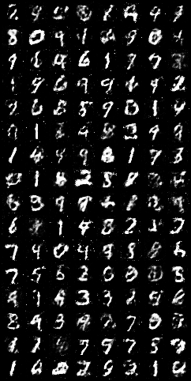
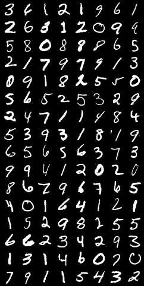

## Notes

Training discriminator for `K` steps following the provided algorithm gives better result in eariler epochs. Implementation for `K` steps and mini batch yield order does not exactly match the paper algorithm.

## Results

Result of the python code (not the jupyter notebook) with, 

```
self.lr = 3e-4
self.z_dim = 64
self.batch_size = 128
self.num_epochs = 100
self.K = 3 
```




## Result Improvement

- Try deeper and complex networks.
- Use convolutional neural networks.
- Try batch normalization, dropout, different activation funcitons.
- Try newer GAN architectures and approaches.
- Try augmentations, different loss functions. 
- Weight saving and loading with inference.
- Latent space control to generate random images.
- Interpolate between images.
- Command line arguments for running custom dataset.

## TODO

- Remove fake sample detach on discriminator training portion as it is no longer the use case when using k steps of discriminator optimization.
- Check if `LeakyReLU` or `ReLU` was used in original paper and change accordingly.

## References

- Original GAN paper, https://arxiv.org/abs/1406.2661
- Code this is based on with explanation, https://www.youtube.com/watch?v=OljTVUVzPpM
