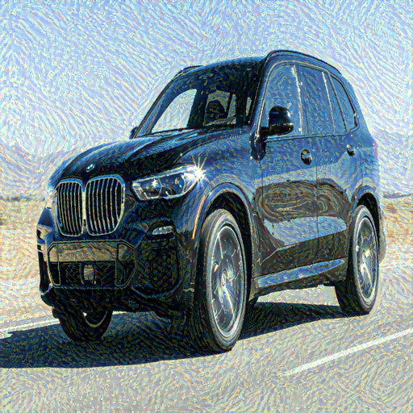

## Notes

Only two images are required to obtain a generated image result. Cycle GAN paper mentions NST(Neural Style Transfer) is between two images and image-to-image translation networks such as Cycle GAN can learn the artistic style between collections of images.

The implementation does not exactly match the paper. Gatys 2016, paper goes into more detail on the implementation.

## Results

 

 

## TODO

- Put the code in python file.
- Try to implement as shown in Gatys 2016.

## References

- Neural style transfer video, https://www.youtube.com/watch?v=imX4kSKDY7s.
- Neural style transfer code, https://github.com/aladdinpersson/Machine-Learning-Collection/tree/master/ML/Pytorch/more_advanced/neuralstyle.
- Neural style Gatys 2016, https://www.cv-foundation.org/openaccess/content_cvpr_2016/papers/Gatys_Image_Style_Transfer_CVPR_2016_paper.pdf.
- Neural style Gatys 2015, https://arxiv.org/abs/1508.06576.
