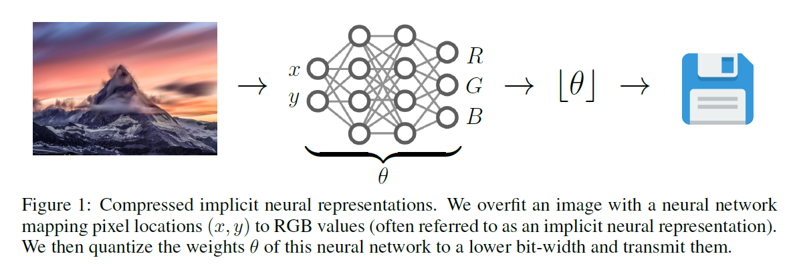

# Image-Compression-SIREN

Pyotrch implementation of using [Sinusoidal Representation Networks (SIRENs)](https://arxiv.org/abs/2006.09661) to compress and decompress images. Compressed images as models passed over network can be partially or fully decompressed in real time on GPU or CPU similar to [this paper](https://arxiv.org/abs/2103.03123). Code implementation is based on [this notebook](https://github.com/vsitzmann/siren/blob/master/explore_siren.ipynb). 

An easy implementation of SIREN is available [here](https://github.com/lucidrains/siren-pytorch).





## Sample


### TODO:
- Understand why a single full size image is not fitting in GPU memory.
- Include python code to compress and decompress given images in folder.
- Allow saving model for continuing training from checkpoint.
- Clean up and improve jupyter notebooks.
- Try to decode image partially.
- Add FP16 and INT8 quantization.
- Try quantization aware training.
- Read and try to understand, https://github.com/lucidrains/siren-pytorch.
- Read https://arxiv.org/pdf/2104.03960.pdf paper and its implemetation in above link.


## Citations

```bibtex
@misc{sitzmann2020implicit,
      title={Implicit Neural Representations with Periodic Activation Functions}, 
      author={Vincent Sitzmann and Julien N. P. Martel and Alexander W. Bergman and David B. Lindell and Gordon Wetzstein},
      year={2020},
      eprint={2006.09661},
      archivePrefix={arXiv},
      primaryClass={cs.CV}
}
```

```bibtex
@misc{dupont2021coin,
      title={COIN: COmpression with Implicit Neural representations}, 
      author={Emilien Dupont and Adam Goliński and Milad Alizadeh and Yee Whye Teh and Arnaud Doucet},
      year={2021},
      eprint={2103.03123},
      archivePrefix={arXiv},
      primaryClass={eess.IV}
}
```

Citation exported from arXiv.
