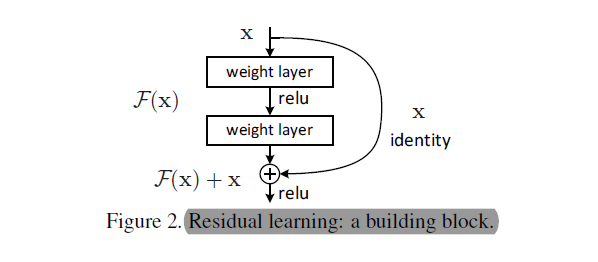
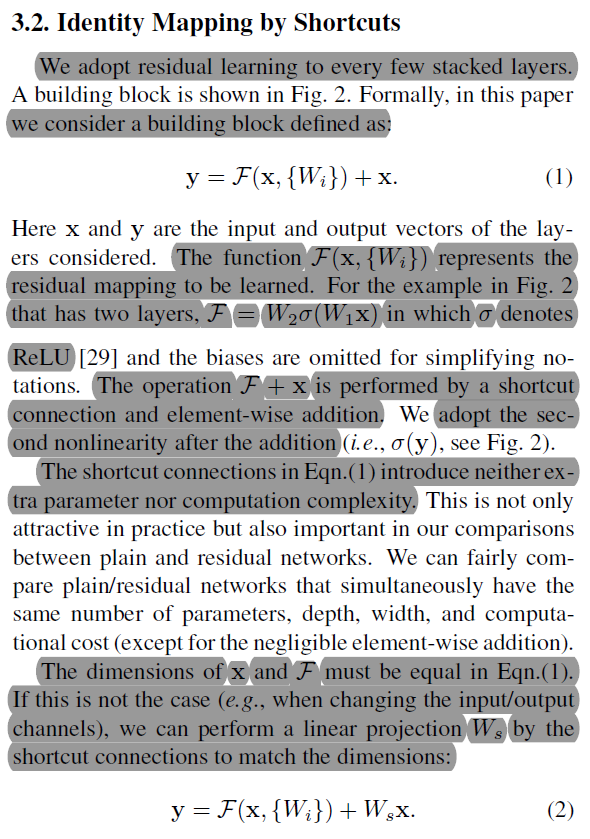
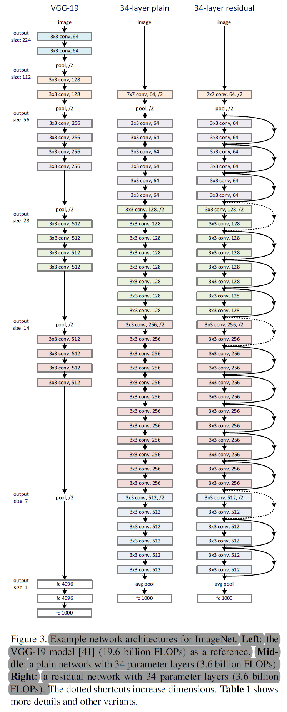
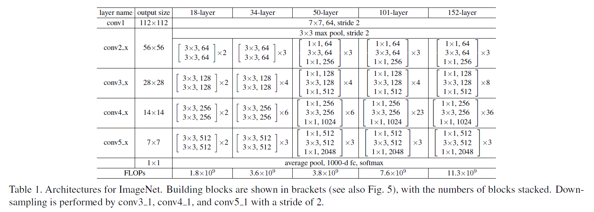
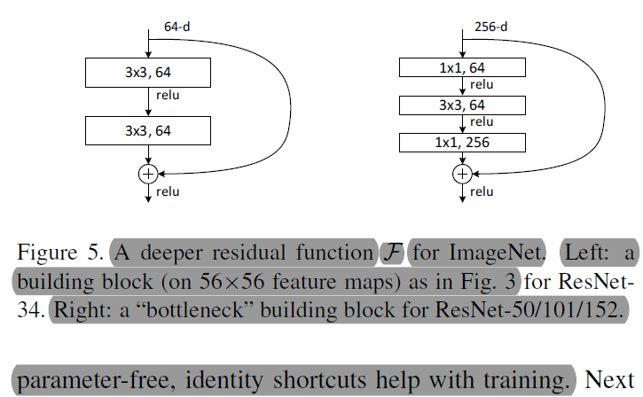
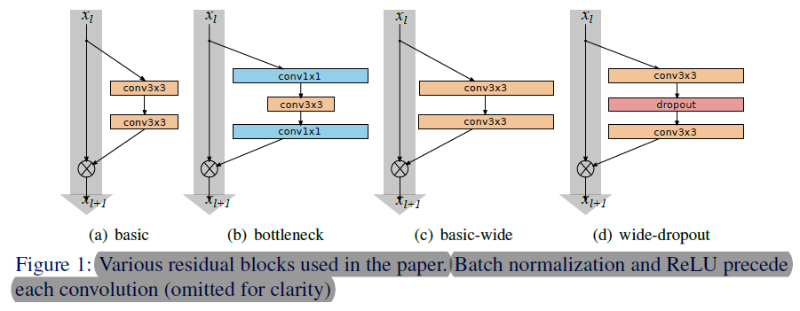
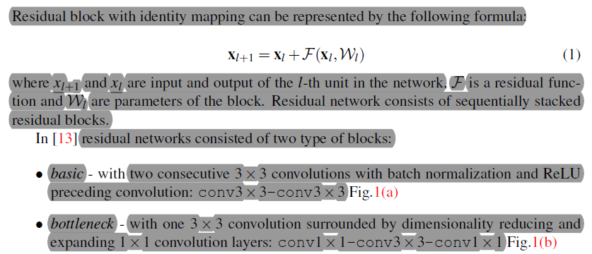
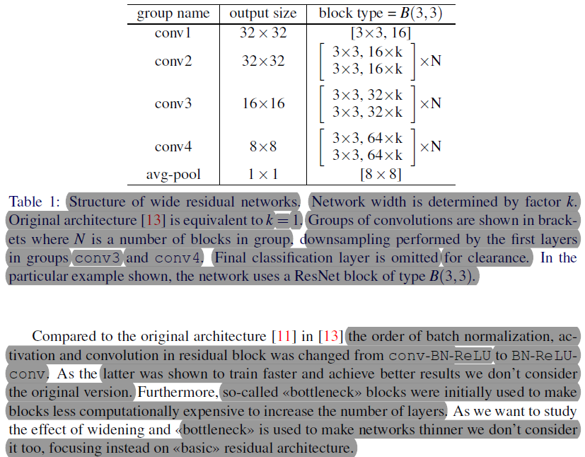
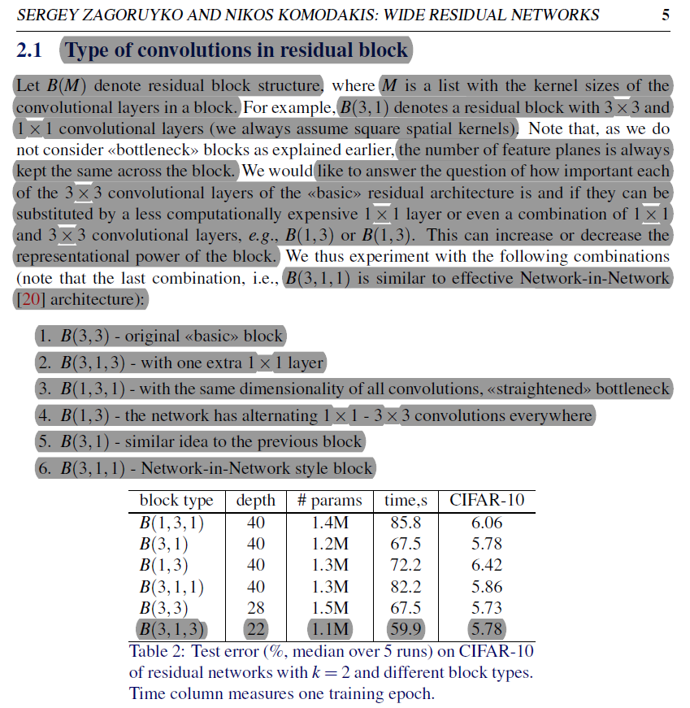

# [AI Notes](https://github.com/quickgrid/AI-Resources/blob/master/ai-notes.md)

Notes from reading various deep learning, computer vision etc. papers. 

Many of the text are copied from paper verbatim, others with some modifications and rephrasing. Figures are from paper. Highlighted portions should be read and only some of the highlighted parts are expanded as notes.

**WARNING:** These notes may contain errors due to misinterpretation, lack of understanding, missing details etc. 

# ResNet Family

### Papers

| Paper | Year | Conference |
| --- | --- | --- |
| [Wide Residual Networks (WRN)](https://arxiv.org/abs/1605.07146) | 2016 |  |
| [Deep Residual Learning for Image Recognition (ResNet)](https://arxiv.org/pdf/1512.03385.pdf) | 2015 |  |

# ResNet 

# Wide ResNet

